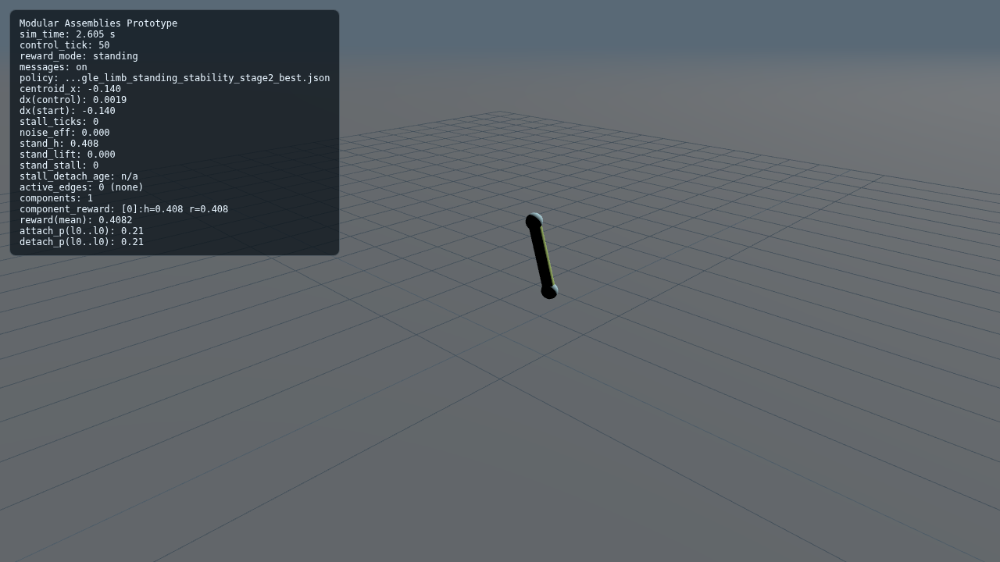
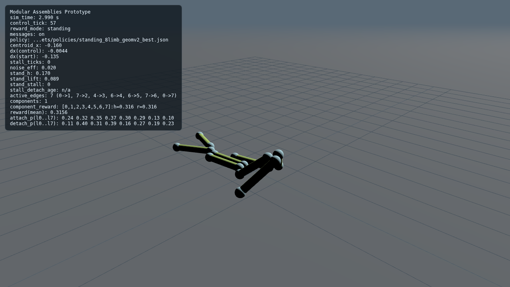
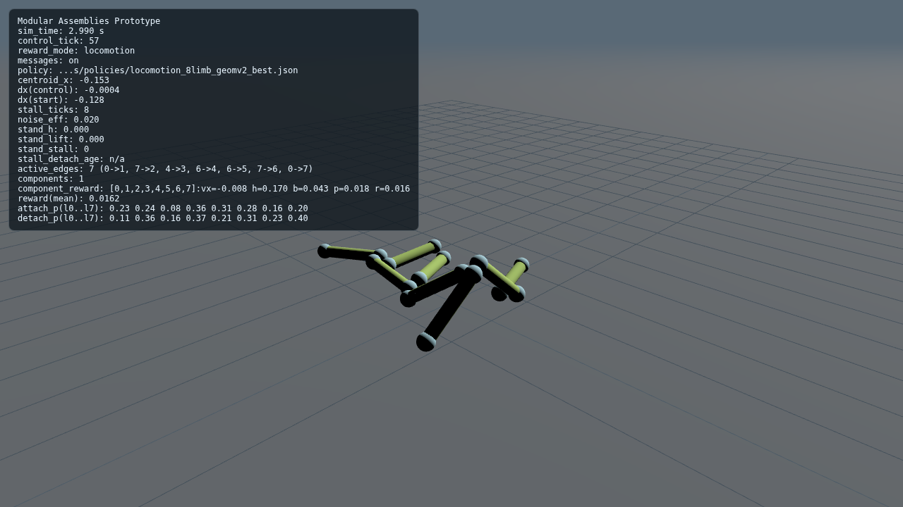

# evobot

A self-contained browser simulation workspace for modular robotic subassemblies in MuJoCo-WASM. [Online Demo Here](https://umar-azam.github.io/evobot/modular_assemblies.html?scene=modular_assemblies_8limb.xml&reward=standing&policy=assets%2Fpolicies%2Fstanding_8limb_geomv2_best.json&noise=0.02&torque_scale=6.5)

This repository packages the exact simulation stack developed in the parent project into a minimal, runnable structure:
- browser simulator with 1-, 4-, and 8-limb scenes,
- tuned standing and locomotion policies,
- repeatable Python tools for training and validation,
- documentation for visual inspection and headless checks.

No additional repositories are required.

## Repository Overview

- `modular_assemblies.html`: browser entrypoint for the modular assemblies simulation.
- `src/`: simulation runtime and control logic.
- `assets/scenes/`: XML scenes (`1limb`, `4limb`, `8limb`).
- `assets/policies/`: tuned policy checkpoints.
- `tools/`: training/evaluation/validation scripts.
- `docs/ARCHITECTURE.md`: concise architecture and data-flow overview.
- `docs/THIRD_PARTY_ORIGINS.md`: origin labels for copied files.
- `THIRD_PARTY_LICENSES/`: third-party license files.

## Prerequisites

- Conda environment `codex` (recommended, used throughout this project).
- Node.js + npm.
- Python 3.10+.
- Chrome/Chromium available for Playwright-based tools.
  - Current tools are configured for `/usr/bin/google-chrome`.

## Environment Setup

From this repository root:

```bash
conda run -n codex npm install
conda run -n codex pip install -r requirements.txt
```

## Run the Simulation (Visual)

Start local static server:

```bash
conda run -n codex python -m http.server 8877
```

Open one of these URLs:

1. Default 4-limb scene:
   - `http://127.0.0.1:8877/modular_assemblies.html`
2. Single-limb upright stability policy:
   - `http://127.0.0.1:8877/modular_assemblies.html?scene=modular_assemblies_1limb.xml&reward=standing&policy=assets/policies/single_limb_standing_stability_stage2_best.json&noise=0&torque_scale=6.5&stand_lift_gain=0&stand_kick_vz=0&stand_kick_vy=0&stand_inward=0&stand_torque=0&stand_lat=0&stall_lift=0&stall_fwd=0&stall_kick_vz=0&stall_kick_vx=0&max_boost=0&stall_detach_every=0&stand_detach_every=0`
3. 8-limb standing (geometry-aware policy):
   - `http://127.0.0.1:8877/modular_assemblies.html?scene=modular_assemblies_8limb.xml&reward=standing&policy=assets/policies/standing_8limb_geomv2_best.json&noise=0.02&torque_scale=6.5`
4. 8-limb locomotion (geometry-aware policy):
   - `http://127.0.0.1:8877/modular_assemblies.html?scene=modular_assemblies_8limb.xml&reward=locomotion&policy=assets/policies/locomotion_8limb_geomv2_best.json&noise=0.02&torque_scale=6.5`

## Simulation Gallery (torque_scale=6.5)

Media below was generated from this repository with:

```bash
conda run -n codex python tools/capture_readme_media.py --torque-scale 6.5 --out-dir docs/media
```

### Single-Limb Upright Stability



<video src="docs/media/single_limb_standing/single_limb_standing.webm" controls muted loop playsinline width="960"></video>

[Download video](docs/media/single_limb_standing/single_limb_standing.webm)

### Eight-Limb Standing



<video src="docs/media/eight_limb_standing/eight_limb_standing.webm" controls muted loop playsinline width="960"></video>

[Download video](docs/media/eight_limb_standing/eight_limb_standing.webm)

### Eight-Limb Locomotion



<video src="docs/media/eight_limb_locomotion/eight_limb_locomotion.webm" controls muted loop playsinline width="960"></video>

[Download video](docs/media/eight_limb_locomotion/eight_limb_locomotion.webm)

## Headless Validation Scenarios

### 1) Invariants (standing)

```bash
conda run -n codex python tools/validate_modular_assemblies_invariants.py \
  --url "http://127.0.0.1:8877/modular_assemblies.html?headless=1&scene=modular_assemblies_8limb.xml&reward=standing" \
  --reward-mode standing
```

### 2) Invariants (locomotion)

```bash
conda run -n codex python tools/validate_modular_assemblies_invariants.py \
  --url "http://127.0.0.1:8877/modular_assemblies.html?headless=1&scene=modular_assemblies_8limb.xml&reward=locomotion" \
  --reward-mode locomotion
```

### 3) Single-limb upright check (active vs passive)

```bash
conda run -n codex python tools/validate_single_limb_standing.py \
  --url "http://127.0.0.1:8877/modular_assemblies.html?headless=1&scene=modular_assemblies_1limb.xml&reward=standing&policy=assets/policies/single_limb_standing_stability_stage2_best.json&noise=0&torque_scale=6.5&stand_lift_gain=0&stand_kick_vz=0&stand_kick_vy=0&stand_inward=0&stand_torque=0&stand_lat=0&stall_lift=0&stall_fwd=0&stall_kick_vz=0&stall_kick_vx=0&max_boost=0&stall_detach_every=0&stand_detach_every=0" \
  --steps 12000
```

## Policy Optimization Workflows

### 8-limb standing optimization

```bash
conda run -n codex python tools/train_modular_policy_cem.py \
  --url "http://127.0.0.1:8877/modular_assemblies.html?headless=1&scene=modular_assemblies_8limb.xml&reward=standing&noise=0.02&torque_scale=1.0" \
  --generations 14 --population 20 --elite 5 \
  --rollout-steps 1200 --final-eval-steps 2000 --final-eval-repeats 5 \
  --init-sigma 0.03 --sigma-decay 0.975 --eval-random-torque-scale 0.02 \
  --w-edge-mean 0.1 --w-edge-nonzero 0.1 --w-forward-x 0 --w-displacement 0 --w-reward 42
```

### 8-limb locomotion optimization

```bash
conda run -n codex python tools/train_modular_policy_cem.py \
  --url "http://127.0.0.1:8877/modular_assemblies.html?headless=1&scene=modular_assemblies_8limb.xml&reward=locomotion&policy=assets/policies/locomotion_8limb_geomv2_best.json&noise=0.02&torque_scale=1.15" \
  --generations 18 --population 24 --elite 6 \
  --rollout-steps 1400 --final-eval-steps 2400 --final-eval-repeats 5 \
  --init-sigma 0.025 --sigma-decay 0.98 --eval-random-torque-scale 0.02 \
  --w-edge-mean 0.1 --w-edge-nonzero 0.1 --w-forward-x 22 --w-displacement 4 --w-reward 3
```

## Notes

- Generated outputs are written under `artifacts/`.
- The repository is intentionally minimal: only files required for modular-assemblies simulation and associated workflows are included.
- File provenance and third-party labels are documented in `docs/THIRD_PARTY_ORIGINS.md`.
